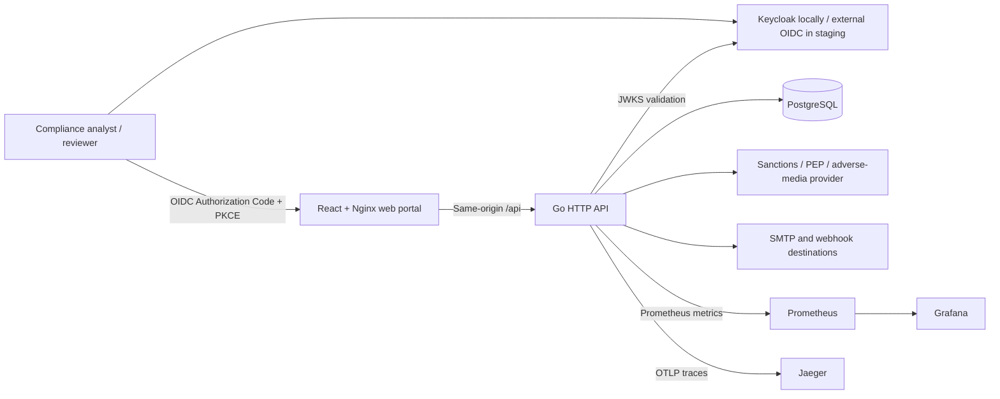
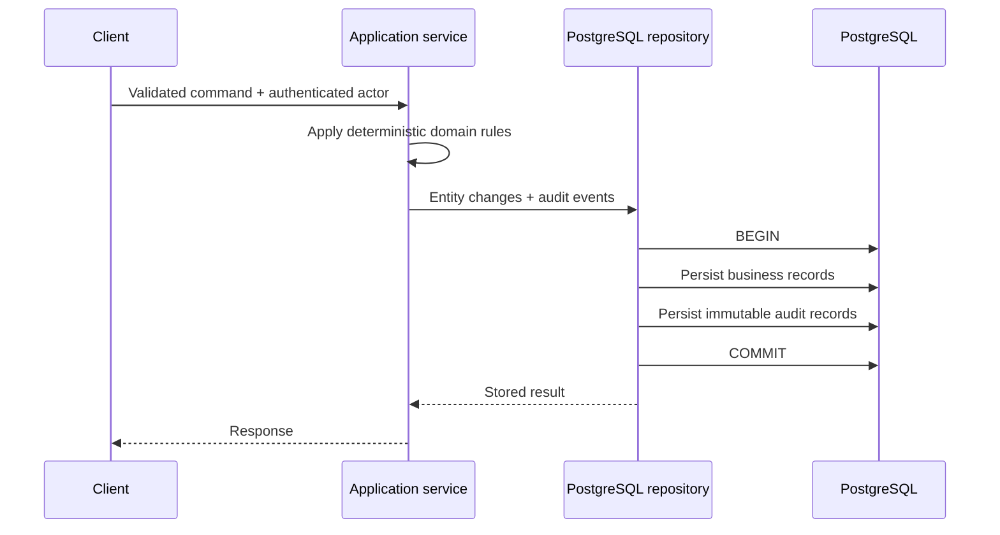

# Architecture

## System context

The browser never handles passwords and the API never trusts a caller-supplied actor. The JWT subject becomes the audit actor, while realm roles enforce analyst, reviewer, and administrator permissions.

## Backend structure

The Go service follows a small ports-and-adapters layout:

- `internal/domain` contains deterministic risk and monitoring rules plus domain records;
- `internal/application` validates commands, coordinates workflows, and creates audit events;
- `internal/infrastructure/postgres` implements transactional repositories;
- `internal/infrastructure/screening` and `notification` isolate external providers;
- `internal/transport/httpapi` maps authenticated HTTP requests to application services;
- `cmd/api` assembles configuration, migrations, workers, observability, and graceful shutdown.

Risk scoring remains a pure, versioned domain calculation. It has no database or HTTP dependency, which makes a historical score reproducible from its stored factors and rule version.

## Transaction boundaries

Important atomic operations include:

- customer submission plus `customer.submitted` audit event;
- customer approval/rejection plus review audit event;
- transaction plus monitoring alerts and all corresponding audit events;
- case resolution plus linked alert closure and both audit events;
- screening runs, matches, inbox notifications, delivery outbox jobs, and audit events.

If any statement fails, PostgreSQL rolls back the entire unit. Transaction ingestion also uses an advisory transaction lock and an idempotency key to make concurrent retries safe.

## Runtime and deployment

Local Docker Compose runs the Web, API, PostgreSQL, Keycloak, Prometheus, Grafana, and Jaeger. Embedded, ledger-backed migrations execute before the API becomes ready. `/healthz` checks the process; `/readyz` checks PostgreSQL connectivity.

The Kubernetes staging overlay runs two replicas of both Web and API behind an HTTPS ingress. It includes non-root/read-only security contexts, resource requests and limits, disruption budgets, API autoscaling, and default-deny network policies. PostgreSQL, OIDC, DNS, certificates, and secrets are external production dependencies; see [the deployment guide](../deploy/k8s/README.md).

Workers use leased PostgreSQL jobs with `FOR UPDATE SKIP LOCKED`, allowing multiple API replicas without duplicate screening or notification delivery. Expired leases recover work after crashes.

## Security and operations

- Secrets enter through environment variables or Kubernetes secrets and are never stored in Git.
- External screening uses HTTPS by default, optional private CA/mTLS, bounded payloads, retry, circuit breaking, and stable idempotency headers.
- Security headers, request rate limiting, sensitive-response cache prevention, and protected metrics are enabled at the HTTP edge.
- Metrics, SLOs, traces, alert rules, backups, restore drills, and the threat model are maintained with the application.

Operational references: [threat model](THREAT_MODEL.md), [SLOs](SLO.md), [disaster recovery](DISASTER_RECOVERY.md), and [provider onboarding](PROVIDER_ONBOARDING.md).

## Trust boundary

This repository is a production-oriented portfolio implementation, not a certified AML product. A real deployment still requires jurisdiction-specific policy, licensed data providers, privacy and retention decisions, independent security assessment, model/rule governance, operational ownership, and legal approval.
